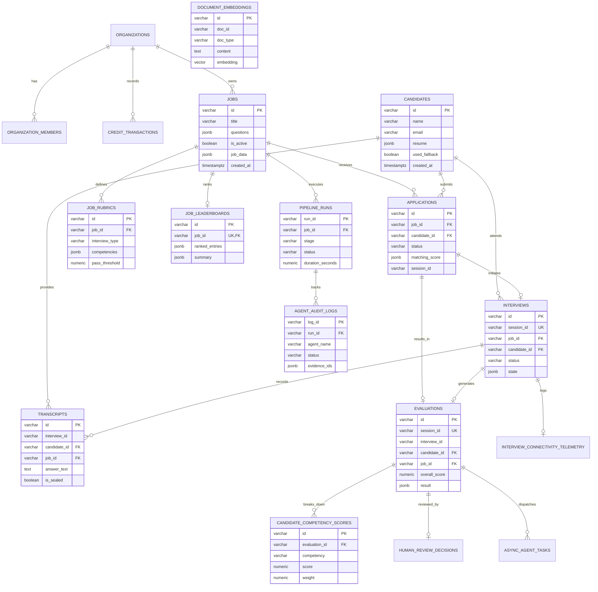

# OpenHire

> An AI-powered interview platform for employer-side, high-volume candidate screening — built for the India campus hiring context (Tier 2/3 connectivity, multilingual candidates, high applicant volume).

OpenHire runs structured, voice-based interviews at scale, evaluates candidates against configurable rubrics using a specialized multi-agent pipeline, and gives recruiters an explainable, evidence-backed shortlist instead of a black-box score.

## 📋 Table of Contents

- [Key Features](#key-features)
- [Project Status](#project-status)
- [Development Stages](#development-stages)
- [Architecture](#architecture)
- [Getting Started](#getting-started)
- [Project Structure](#project-structure)
- [Development](#development)
- [Documentation](#documentation)
- [Team](#team)

## ✨ Key Features

- **Voice-based Interviews at Scale** — Structured, multilingual interview delivery via voice with fallback support for low-connectivity regions
- **Multi-Agent Evaluation Pipeline** — Specialized agents for orchestration, technical/skill evaluation, integrity probing, scoring, and report generation
- **Configurable Rubrics** — Role-aware, competency-based evaluation with weighted scoring
- **Explainable Results** — Evidence-backed candidate rankings with audit trails and human review gates
- **India-Ready** — Built for campus hiring: multilingual support, connectivity fallbacks, data residency compliance

## 📊 Project Status

**Current Stage: 1 (Basic Prototype)** — Single-candidate linear interview loop with voice transcription and LLM scoring.

### Live Progress Tracker

📊 Open [`pages/roadmap.html`](pages/roadmap.html) in your browser (or visit `/app/roadmap.html` when running the server) for interactive, real-time checklist tracking across all roles and stages.

## 🎯 Development Stages

Development is staged so every milestone is a working, demoable system — not a partial build. Stage 1 ships before Stage 2 begins, and so on.

### Stage 1 — Basic Prototype ✅

A single, linear, single-candidate interview loop: a recruiter creates a job with a fixed question list, a candidate completes a voice interview via link, speech-to-text transcribes the answers, one LLM call scores the transcript against the job, and the recruiter sees a score and report.

**Scope:** One interview type, one language (English), no resume screening, no adaptive follow-up questions, no fallback ladder, one candidate at a time.

**Stack:** React web app, Node/Python API layer, cloud STT (e.g. Whisper API), single LLM call for question delivery + scoring, Postgres for persistent data, single deployment environment.

**Goal:** Prove the loop works end to end.  
**Difficulty:** Low–Medium

### Stage 2 — Advanced 🔄

The scripted flow becomes adaptive: the AI asks conversational follow-up questions based on what the candidate actually said, evaluation moves to a rubric per competency instead of one number, recruiters can configure multiple interview types (technical / HR / aptitude) with role-configurable scoring weights, and both dashboards become functional — recruiters get a filterable, ranked shortlist, candidates get status tracking.

**Additions:** Conversation-state management, JSON-configurable rubric builder, per-competency scoring output, filterable dashboards, recruiter/candidate auth and roles.

**Goal:** An adaptive, role-aware, multi-competency system with dashboards recruiters can actually use to make decisions.  
**Difficulty:** Medium–High

### Stage 3 — Complete Multi-Agent System 🔮

The single do-everything agent splits into specialized agents:
- **Orchestrator** — runs the live conversation
- **Technical/Skill Evaluator** — domain expertise assessment
- **Integrity Agent** — conversational-probing analysis on sealed transcripts (not a detection classifier)
- **Scoring Agent** — aggregates weighted rubric results
- **Report Generation Agent** — explainable reports + leaderboards

Evaluation agents run asynchronously on sealed transcripts after the interview ends — not live — keeping the candidate-facing interview fast and cost per interview manageable at volume.

**Additions:** Async task queue (e.g. Celery/BullMQ), vector DB for JD–resume context and rubric/question-bank lookup, defined agent I/O contracts, per-agent audit logging.

**Goal:** A modular, auditable, specialized pipeline. Recruiters get rich, evidence-backed reports per candidate; integrity flags are surfaced for human review and never auto-reject.  
**Difficulty:** High–Very High

### Stage 4 — Production 🚀

Everything needed to run this on a real Indian campus drive at volume: multilingual and code-mixed interviews, connectivity fallback ladder (video → audio → async → phone call), bias testing across language/accent slices, explainability tied to transcript evidence, mandatory human review gates before hiring decisions, India-only data residency with encryption and access control, monitoring/observability, and scalable architecture for burst loads (thousands of interviews in a single week) — plus Naukri/ATS sync, WhatsApp/SMS delivery, and per-interview INR credits billing model.

**Goal:** A hardened, compliant, India-ready product that can be sold and operated at scale.  
**Difficulty:** Very High

## 🏗️ Architecture

### Difficulty by Domain & Stage

| Domain | Stage 1 | Stage 2 | Stage 3 | Stage 4 |
|---|---|---|---|---|
| **Frontend** | Medium | Medium | Medium | Medium–High |
| **Backend** | Medium | Medium–High | High | Very High |
| **Database** | Low | Medium | Medium–High | High |
| **Multi-Agent System** | Medium | High | Very High | Very High |
| **Fullstack** | Medium | Medium–High | High | High |

**Note:** Multi-Agent System is the steepest curve on the team — plan pairing or backup coverage there from Stage 2 onward. Backend and Fullstack ramp hardest in Stage 4, when integrations, scale, and security all land at once.

### Database Schema



## 🚀 Getting Started

> TODO: Add installation, setup, and quick-start instructions

## 📁 Project Structure

```
OpenHire/
├── pages/                      # Frontend web app (React)
│   ├── js/                     # React components & UI logic
│   ├── css/                    # Stylesheets
│   └── roadmap.html            # Interactive progress tracker
│
├── agents/                     # Multi-agent system components
│   ├── orchestrator/           # Interview orchestrator agent
│   ├── interviewer/            # Conversational interview agent
│   ├── technical_evaluator/    # Technical skills evaluation
│   ├── behavioral_evaluator/   # Behavioral assessment
│   ├── integrity/              # Integrity & authenticity probing
│   ├── scoring/                # Score aggregation
│   ├── report_generator/       # Report generation
│   ├── resume_parser/          # Resume parsing
│   ├── resume_matcher/         # Resume-JD matching
│   ├── jd_analyzer/            # Job description analysis
│   └── ...                     # Other specialized agents
│
├── api/                        # REST API layer
│   └── routes/                 # API endpoints
│
├── core/                       # Core business logic
├── providers/                  # External service providers
│   ├── llm/                    # LLM provider interfaces
│   ├── audio/                  # Audio/speech providers
│   ├── embeddings/             # Embedding providers
│   └── vector_store/           # Vector database providers
│
├── repositories/               # Data access layer
│   └── postgres/               # PostgreSQL repository
│
├── db/                         # Database migrations & schemas
├── schemas/                    # Data models & validation schemas
├── services/                   # Business logic services
│
├── evaluation/                 # Evaluation test cases & reports
│   ├── cases/                  # Test scenarios
│   └── reports/                # Evaluation results
│
├── orchestration/              # Pipeline orchestration logic
├── prompts/                    # LLM prompt templates
├── design-system/              # UI design system components
├── config/                     # Configuration files
├── deploy/                     # Deployment scripts & configs
├── data/                       # Sample data & fixtures
├── utils/                      # Utility functions
├── tests/                      # Test suite
│   └── fixtures/               # Test fixtures
│
├── main.py                     # Application entry point
├── .env.example                # Environment variables template
├── docker-compose.postgres.yml # Docker compose for Postgres
└── README.md                   # This file
```

## 🛠️ Development

### Prerequisites

> TODO: Add Node, Python, Postgres, and other dependency requirements

### Setup

> TODO: Add local development setup instructions, environment variables, and database initialization

### Running the App

> TODO: Add commands to start the development server and run tests

## 📚 Documentation

- **[Interactive Roadmap & Progress Tracker](pages/roadmap.html)** — Live dashboard tracking milestone deliverables, role ownership, and completion percentages
- **[Multi-Agent System Implementation](docs/multi-agent-system.md)** — The Stage 3-level agent pipeline (orchestrator, evaluators, scoring, reporting) built ahead of schedule as a working foundation
- **[Stage 1 Project Flow](docs/roles/PROJECT_FLOW.md)** — The step-by-step interview path and role interface shapes

## 👥 Team

5-person team split across: **Frontend · Backend · Database · Multi-Agent System · Fullstack**
