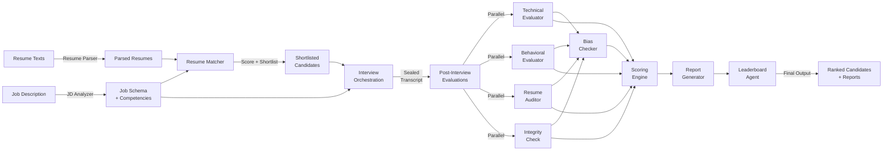

# OpenHire: Multi-Agent Hiring Evaluation System

An explainable, multi-agent AI system for automated candidate evaluation and screening. Uses specialized agents to analyze job requirements, parse resumes, conduct interviews, evaluate candidates across multiple dimensions, and produce transparent hiring recommendations with full evidence trails.

This is the Multi-Agent System role's implementation. See [roles/multi-agent.md](roles/multi-agent.md) for how this fits into the team's staged roadmap — this implementation covers the full Stage 3 agent split (orchestrator, technical/behavioral evaluators, integrity, bias checker, scoring, report generation, leaderboard) built ahead of schedule as a working foundation to grow into.

## 🎯 Problem Statement

Traditional recruitment processes are slow, inconsistent, and subject to human bias. OpenHire automates the screening and evaluation stages using a transparent, auditable multi-agent system that:

- **Extracts job requirements** automatically from job descriptions
- **Scores resume-job fit** with quantified matching
- **Conducts structured interviews** with adaptive questions
- **Evaluates multiple dimensions**: technical skills, behavioral fit, resume claim verification, integrity checks, and bias auditing
- **Provides explainable recommendations** with evidence trails for every decision
- **Produces ranked candidate leaderboards** with flagged items requiring human review

## 🏗️ Architecture

### System Overview



### Agent Responsibilities

| Agent | Input | Output | Purpose |
|-------|-------|--------|---------|
| **JD Analyzer** | Raw job description text | `JobDescription` with extracted competencies, skills, requirements | Parse job description into structured format with skill requirements and competency weights |
| **Resume Parser** | Raw resume text | `ParsedResume` with education, experience, skills | Extract structured resume data via `ResumeParseResult` (P7); falls back to a deterministic, text-grounded extractor only if structured extraction fails |
| **Resume Matcher** | Job description + Resume | `MatchingScore` with skill gaps and match % | Evaluate resume-job fit and shortlist candidates |
| **Interviewer** | Job description + Resume | List of `InterviewQuestion` objects | Generate adaptive, structured interview questions |
| **Technical Evaluator** | Job description + Resume + Transcript | `TechnicalEvaluation` with competency scores | Evaluate technical skills and depth against job requirements |
| **Behavioral Evaluator** | Job description + Resume + Transcript | `BehavioralEvaluation` with soft skill scores | Assess communication, problem-solving, teamwork, adaptability |
| **Resume Auditor** | Resume + Transcript | List of `ClaimVerification` results | Verify resume claims against interview discussion |
| **Integrity Agent** | Resume + Transcript | `IntegrityEvaluation` with flags | Detect inconsistencies and discrepancies between resume and interview |
| **Bias Checker** | All evaluations + Transcript | `BiasAudit` with flags and severity | Audit evaluation text for demographic/appearance/personality bias |
| **Scoring Agent** | All component evaluations + Job weights | `CandidateScores` (technical, behavioral, job_fit, final) | Synthesize component scores into final weighted score |
| **Report Generator** | All evaluations + Scores | `CandidateReport` comprehensive | Generate detailed evaluation report with recommendations |
| **Leaderboard Agent** | List of candidate reports | `CandidateLeaderboard` ranked | Rank candidates and highlight those requiring human review |

## 🔑 Key Features

### 1. Evidence-Based Evaluation
Every score has supporting evidence from the interview transcript or resume:
- Quote-level traceability with timestamps
- Sources clearly marked (transcript Q/A #, resume section)
- Explanation of relevance to competency assessment

### 2. Sealed Interview Transcripts
Once interview ends, transcript is immutable:
- Prevents evidence fabrication post-interview
- Ensures audit trail integrity
- Supports compliance requirements

### 3. Explainable AI
- No black-box scoring; every decision justified
- Visual breakdown of score components
- Recommendations include rationale
- Bias audit flags enable transparency

### 4. Parallelized Evaluation
Post-interview evaluations run concurrently:
- Technical, Behavioral, Resume Audit, Integrity checks execute in parallel
- Reduces total evaluation time
- Bias checker runs after parallel evaluations complete
- Scoring synthesizes all results

### 5. Adaptive Interview Engine (P3) + Session Runner (P4)
The batch `Interviewer` agent in the table above pre-generates a fixed
question set before any interview happens. Separately, a live, turn-based
adaptive interview is available with a strict separation of responsibilities:

```
InterviewSessionRunner (utils/interview_session.py)
    lifecycle + sequencing only: CREATED -> ACTIVE -> FINISHING -> SEALED/FAILED
        |
        v
Adaptive Interview Engine (utils/adaptive_interview.py)
    pure, deterministic decision logic - no LLM calls:
    decide_next_action() / competency prioritization / termination / dedup
        |
        v
InterviewerAgent (agents/interviewer/agent.py)
    the only LLM-calling surface: evaluate_answer() judges one answer
    against one competency; generate_next_question() phrases the text of
    one already-decided question. Neither method chooses WHAT happens next.
        |
        v
Evidence system (utils/evidence.py)
    canonical, deterministic EvidenceItem construction (P2) - the interview
    engine's per-turn evidence and the evaluators' post-interview evidence
    both use this same construction path, never a second format.
        |
        v
Sealed InterviewTranscript (schemas/interview.py)
    the SAME model the batch pipeline already consumes -> flows into the
    existing, unmodified TechnicalEvaluator / BehavioralEvaluator /
    ResumeAuditor / Integrity / BiasChecker / Scoring / Report / Leaderboard
    pipeline (orchestration/graph.py) exactly like any other transcript.
```

A caller drives one interview with a plain loop - no web framework, HTTP, or
WebSocket dependency:
```python
runner = InterviewSessionRunner(job_description, parsed_resume)
question = await runner.start()
while question is not None:
    result = await runner.submit_answer(candidate_answer_text)
    question = result.next_question
transcript = runner.get_transcript()  # sealed, ready for the pipeline above
```

**Evidence: interview-time vs. evaluator-time.** The session runner builds
one `EvidenceItem` per answered turn, straight from the verbatim answer text
(`utils.adaptive_interview.build_answer_evidence`) - this is *source*
evidence: proof an exchange happened and what was actually said, used only
to drive the adaptive engine's own next-question decisions. It is not
written back into the sealed transcript or exposed to the batch evaluators.
Technical/Behavioral/ResumeAuditor/Integrity independently derive their own
*judgment* evidence from the sealed transcript via
`utils.evidence.resolve_transcript_evidence`, exactly as they do for any
other transcript (adaptive-interview-produced or not) - unchanged by P3/P4.
Both paths share the same canonical `EvidenceItem` model and the same
deterministic ID scheme (`utils.evidence.build_evidence_id`), so there is
one evidence *format*, not two, and no reconciliation step is needed: the
two evidence sets serve different purposes (steering the interview vs.
justifying the final score) and are never merged or compared against each
other.

### 6. Live Interview API (P5)
A thin FastAPI service (`api/`) exposes the P4 `InterviewSessionRunner` over
HTTP for a real client to drive turn by turn. It contains **no interview
intelligence of its own** - every route handler does at most one call into
the existing application layer and reshapes the result:

```
Client
   |  HTTP (JSON)
   v
FastAPI routes (api/routes/interview.py)
   |  translate request -> exactly one call -> translate response
   v
InterviewSessionRunner (utils/interview_session.py)          <- P4, unchanged
   |
   v
Adaptive Interview Engine (utils/adaptive_interview.py)      <- P3, unchanged
   +  InterviewerAgent (agents/interviewer/agent.py)         <- P3, unchanged
   +  Evidence system (utils/evidence.py)                    <- P2, unchanged
   |
   v
Sealed InterviewTranscript
   |
   v
Existing Evaluation Pipeline (orchestration/graph.py)        <- P0-P2, unchanged
```

Endpoints: `POST /sessions` (create + first question), `GET /sessions/{id}`
(status/progress), `POST /sessions/{id}/answers` (submit an answer, get
evidence + next question), `POST /sessions/{id}/finish` (explicit
termination, routed through the same termination validation as any other
finish), `GET /health` (liveness only - no LLM call, no API key).

**Session storage** is an in-memory `SessionRegistry` (`api/registry.py`)
keyed by a random `session_id` - no database. **Responses are deliberately
narrow views** (`api/models.py`): a candidate never sees the adaptive
engine's internal `reason` for a question, the full transcript is never
dumped back after an answer, and the raw `InterviewState`/`EvidenceItem`
objects never leave the process. **Errors** map to `400` (bad
business-rule input), `404` (unknown session), `409` (operation invalid for
the session's current lifecycle state), `422` (schema validation, handled
by FastAPI/pydantic automatically), or `500` (genuine session failure /
unexpected error) - never a raw stack trace or exception message.

Run locally (mock mode, no `OPENAI_API_KEY` needed):
```bash
python -m uvicorn api.app:app --reload
```

**Authentication is intentionally not implemented** in P5 - see
`tests/test_api.py` for the isolation/concurrency/prompt-injection
guarantees that stand in for it today (session_id as the sole, unguessable
access boundary), and treat adding real auth as a prerequisite before this
API is reachable from anywhere other than local development.

### 7. Provider Abstraction
Swap LLM, embedding, or vector store implementations:
- Local testing with mock providers (no API keys)
- Production deployments with OpenAI, Azure, or self-hosted
- Change providers via environment variables at runtime

Every `LLMProvider` implements two methods:
```
LLMProvider
├── generate(prompt) -> str                          # free-text completion
└── generate_structured(prompt, schema) -> dict       # schema-conformant JSON
```
Agents that need structured data (JD analysis, resume parsing,
technical/behavioral evaluation, resume audit, integrity/bias checks,
interview question generation) call `generate_structured()` with a JSON
Schema derived directly from a Pydantic model in `schemas/llm_outputs.py`
(`SomeModel.model_json_schema()`), then validate the response against that
same model (`SomeModel.model_validate(result)`) before converting it into the
agent's real output schema. Agents never hand-write JSON Schemas or call
`json.loads()`/catch `JSONDecodeError` themselves - that's the provider's
job. `BaseAgent.call_llm_structured(..., validate=SomeModel.model_validate)`
wires validation into the same bounded retry/timeout budget as provider
failures (see `agents/base.py`), so a malformed or schema-invalid response is
retried a bounded number of times and then fails explicitly - it is never
silently replaced with fabricated data. As of P7, every LLM-calling agent
follows this pattern - Resume Parser (previously the one holdout, using
`generate()` + manual `json.loads()`) was migrated last; see "Resume Parser
Hardening" below for its specific fallback policy.

- **Mock mode** (`LLM_PROVIDER=mock`, the default) requires no API key -
  `MockLLMProvider` returns deterministic, schema-valid responses for every
  known agent prompt, so the full pipeline and test suite run offline.
- **Real providers** (e.g. `LLM_PROVIDER=openai`) require credentials
  (`OPENAI_API_KEY`) and fail clearly - never silently falling back to mock -
  if they can't produce a valid response.
- Agents are provider-agnostic: they only ever call `generate()` /
  `generate_structured()` on `self.llm_provider` - never anything
  OpenAI/Claude/Gemini-specific. All vendor-specific logic (auth, request
  shape, transient-vs-permanent error classification) lives in
  `providers/llm/*.py`.

**Three provider implementations, three different jobs (finalized P8A):**
- `MockLLMProvider` (`providers/llm/mock.py`) - the default LLM_PROVIDER.
  Dispatches on each prompt template's fixed title header and always
  returns a fixed, schema-valid response - it never simulates a failure. If
  a prompt matches no known template, it falls back to a best-effort shape
  (`_create_mock_structure`) that is NOT guaranteed schema-valid; agent-level
  Pydantic validation (not the provider) is what actually enforces
  correctness here - see `tests/test_structured_output_provider.py`. Its
  purpose is "always succeed with something" for local development and the
  default `python main.py` run, not failure-mode testing.
- `ScriptedLLMProvider` (`tests/fakes.py`) - the fake used throughout
  `tests/` and `evaluation/adapters.py` to simulate a SPECIFIC LLM response
  (or failure) per call. Its `generate_structured()` classifies malformed
  JSON text as `LLMTransientError` (retryable) - matching
  `OpenAIProvider`'s real classification of malformed JSON exactly (P8A: a
  P7 fix - previously it raised a raw, unclassified `json.JSONDecodeError`
  that bypassed `BaseAgent`'s retry entirely, understating how many
  attempts a real malformed-output scenario actually takes). A script entry
  that IS an `Exception` instance (e.g. `LLMPermanentError("bad key")`) is
  raised as-is, letting a case simulate a permanent provider failure too.
- `OpenAIProvider` (`providers/llm/openai.py`) - the real provider.
  Classifies empty choices/empty content/truncated responses/malformed
  JSON as `LLMTransientError`; auth/bad-request/unknown errors as
  `LLMPermanentError`; network/rate-limit/5xx as `LLMTransientError`. This
  is the reference behavior every fake above is checked against.

### 7a. Primary Real Provider: Groq + openai/gpt-oss-20b (P8B.3)

As of P8B.3, **Groq is OpenHire's primary real LLM provider** and
**`openai/gpt-oss-20b` is the primary benchmark model**. The project is
developed and evaluated against that model.

| Provider | `LLM_PROVIDER` | Role |
| --- | --- | --- |
| **Groq** | `groq` | **PRIMARY.** Real LLM behavioral evaluation and agent development. Model `openai/gpt-oss-20b`. |
| Mock | `mock` | Local deterministic regression testing. No API key, no network. The default. |
| Gemini | `gemini` | Supported, no longer primary. |
| OpenAI | `openai` | Supported, no longer primary. |

Configuration (`.env`, which is gitignored - the key never belongs in a
tracked file, a log, a report, or an exception):

```
LLM_PROVIDER=groq
GROQ_API_KEY=...
GROQ_MODEL=openai/gpt-oss-20b
```

`GROQ_API_KEY`/`GROQ_MODEL` are read in `config/settings.py`; the factory
in `providers/llm/__init__.py` maps `LLM_PROVIDER=groq` to `GroqProvider`.

#### Two kinds of testing - do not confuse them

OpenHire deliberately runs two different test regimes, and neither replaces
the other:

1. **Local deterministic regression testing** (`LLM_PROVIDER=mock`,
   `pytest tests/`, `python -m evaluation.runner`). Uses mocks and
   `ScriptedLLMProvider`. It answers: *does our CODE handle a given LLM
   response correctly?* It is fast, offline, and deterministic, and it must
   stay that way - do not replace unit tests with real API calls.
2. **Real LLM behavioral evaluation**
   (`python -m evaluation.runner --provider groq`). Uses the real Groq
   model. It answers: *does the real model actually behave correctly given
   our prompts?* This is the authoritative signal for prompt quality,
   evidence grounding, hallucination resistance, and prompt-injection
   resistance.

**A green mock run is not evidence that the real model behaves correctly.**
P8B.3 demonstrated this concretely: the mock suite was 83/84 PASS while the
real model was, at the same time, obeying prompt injections in resumes,
dropping a stated seniority level, and omitting competencies entirely when
an answer was off-topic. Those defects were invisible to the mock run by
construction, because the mock plays back the response the case author
already believed was correct.

#### Groq structured-output adaptation

`GroqProvider.prepare_schema()` (see `providers/llm/groq.py`) contains the
only Groq-specific schema handling in the system - no agent knows anything
about Groq. Groq's `strict` JSON-schema mode enforces numeric bounds and
enums, which is valuable, but demands `additionalProperties: false` on
every object and a `required` list naming every property - neither of which
a raw `Model.model_json_schema()` provides. The provider adds both.

The single shape strict mode cannot express is an open-ended map
(`Dict[str, CompetencyJudgment]` in the evaluator schemas). Rather than
weaken those agent schemas, the provider detects that shape and drops to
non-strict mode for that request only, sending the original schema
unchanged; Pydantic validation plus `BaseAgent`'s bounded retry enforce the
numeric bounds instead. Provider-layer adaptation, never agent-layer
compromise.

The test-provider failure behavior is intentionally designed to mirror this
production classification, not to diverge from it for convenience - a case
that scripts malformed JSON is exercising the SAME retry path a real
malformed OpenAI response would take, not a shortcut around it.

#### Golden-case classification: A / B / C (P8B.4, extended P8B)

Not every golden case measures the same thing, and a real-provider run must
not conflate them. Each case in `evaluation/cases/*.json` is exactly one of:

- **A. Real LLM behavioral case** (the default - no `provider_contract`
  tag). Its checks describe a contract a real, well-behaved model is
  expected to satisfy; running it under `--provider groq` is a meaningful
  measurement.
- **B. Deterministic production-agent / business-logic case**
  (`metadata.provider_contract == "mock_only_business_logic_contract"`).
  Exercises a specific piece of AGENT CODE (competency-weight
  normalization, confidence-based severity capping, an out-of-range
  citation's bounds check, a claim-verification demotion path) that a
  real, well-behaved model has no reason to trigger on its own initiative
  - the mock script simulates a MISBEHAVING model on purpose, to prove the
  defensive code catches it.
- **C. Provider/infrastructure-failure case**
  (`metadata.provider_contract == "mock_only_provider_failure_contract"`).
  Simulates the PROVIDER itself misbehaving (malformed JSON, missing
  required fields on every retry, a permanent auth error).

Under `LLM_PROVIDER=mock`, every case (A, B, C) runs exactly as always -
this classification changes nothing about the 84-case mock baseline. Under
a real provider, B and C cases are skipped before ever reaching the API
(`SKIPPED/MOCK_ONLY_BUSINESS_LOGIC_CONTRACT` /
`SKIPPED/MOCK_ONLY_PROVIDER_FAILURE_CONTRACT`) - see
`evaluation/runner.py`'s `is_mock_only_case`/`mock_only_skip_reason`.
`--max-calls N` bounds the real calls one invocation may make (counts every
actual provider call including retries, not case count); once exhausted,
remaining cases are `SKIPPED/BUDGET_EXHAUSTED`, never fabricated as
PASS/FAIL.

#### Real Groq benchmark results (P8B, three batches)

All 61 real-LLM-applicable cases (of 84 total; the rest are agents with no
LLM call at all - `resume_matcher`, `scoring`, `report_generator`,
`leaderboard` - or bucket B/C) have now been run at least once against real
Groq (`openai/gpt-oss-20b`). This is a real-model BEHAVIOR signal, not a
correctness certification - see "does the real model actually behave
correctly" above; a few findings below are legitimate, accepted model
variance rather than defects.

| Batch | Agents | Attempted | Pass | Fail | Notes |
| --- | --- | --- | --- | --- | --- |
| 1 | jd_analyzer, resume_parser (partial), technical_evaluator (partial), behavioral_evaluator, integrity, bias_checker | 28 | 21 | 7 | Bias Checker `bias_type` prompt fix (below) |
| 2 | technical_evaluator, resume_parser (completion) | 19 | 15 | 4 | Resume Parser stochastic-extraction finding |
| 3 | interviewer_evaluate, interviewer_session_turn, interviewer_adaptive_sequence, resume_auditor | 11 | 8 | 3 | Adaptive-sequence fixture-content fix (below); Groq's daily token quota (200k/day) was exhausted mid-batch, blocking live re-verification of that fix |

**Genuine fixes made from real-model findings:**
- `prompts/bias_checker.md` (Batch 1): the model detected bias correctly
  but invented non-canonical `bias_type` values (`age_bias`,
  `appearance_based_judgments`) because the prompt only gave English-prose
  category headings, not the exact enum vocabulary. Fixed by enumerating
  the exact allowed values in the prompt. Live-reverified: both affected
  cases now pass.
- `evaluation/cases/interviewer.json` (Batch 3): `interviewer_adaptive_sequence`
  cases' `answer_texts` were meta-descriptive placeholders (e.g. `"a
  strong python answer"`) written for the SCRIPTED provider, which ignores
  answer content entirely. Under a real provider the literal placeholder
  text IS the simulated answer, and a real Groq call correctly scored it
  as vague/low (it genuinely is non-substantive text) - not a defect, but
  a fixture-content bug making the case incoherent for real-provider
  testing. Fixed by replacing the placeholders with genuine strong/weak
  answer content; the check/contract itself (sequence must differ by
  answer quality; must terminate on sufficient evidence) was **not**
  weakened. Not yet live-reverified (quota exhausted) - see the P8B batch
  3 report for the exact next step.

**Legitimate real-model behavior, documented rather than "fixed" (no code/
prompt/case-expectation change):**
- Citation ambiguity: a real model sometimes cites the sole/only transcript
  exchange even for a low-scoring or off-topic answer, producing
  `evidence_status="supported"` where a scripted case assumed an uncited
  (`"insufficient"`) outcome. Both are individually correct;
  `evaluation/cases/{technical_evaluator,behavioral_evaluator}.json` note
  this explicitly and a companion pytest regression pins down the
  "cited" outcome as also correct.
- Resume Parser stochastic extraction: on two ambiguous/adversarial inputs,
  identical re-submissions to real Groq (temperature 0.7) alternated
  between a fully-empty-but-valid extraction and a correct, fuller one.
  Confirmed via direct reproduction, not assumed. `prompts/resume_parser.md`
  already gives the injection-experience scenario as a worked example, so
  no further prompt change was applicable; this is model variance, not a
  prompt or code defect. See `evaluation/cases/resume_parser.json` for the
  specific cases and `tests/test_p8b3_groq_agent_fixes.py::
  TestResumeParserAcceptsFullyEmptyValidResultAsNonFabrication` for the
  pinned contract (an all-empty valid result is accepted, never routed to
  the deterministic fallback or treated as a bug).

- Adaptive-interviewer confidence calibration (P8B.5): `openai/gpt-oss-20b`
  reports its own `confidence` field conservatively and stochastically -
  frequently ~0.6 even for genuinely strong, concrete, detailed answers
  (directly observed). Because `MIN_CONFIDENCE_FOR_COVERAGE` is 0.65, any
  golden case gated on the interview reaching
  `sufficient_evidence_collected` becomes a coin-flip on model calibration
  rather than a measure of engine correctness: the two affected cases were
  run four times against real Groq with byte-identical fixtures and
  produced a mix of pass and fail, including one run terminating via
  `no_further_progress_possible` after correctly exhausting
  `MAX_FOLLOW_UPS_PER_COMPETENCY` without the threshold ever being cleared.
  **`MIN_CONFIDENCE_FOR_COVERAGE` was deliberately NOT lowered** - tuning a
  production threshold to accommodate one model's calibration would weaken
  real product behavior to make a benchmark pass. Both cases were instead
  reclassified to bucket B (see below), and
  `tests/test_adaptive_interview.py::TestAdaptiveSelection::
  test_coverage_threshold_is_not_cleared_by_sub_threshold_confidence` pins
  the threshold decision down so it is never silently reversed. The
  deterministic engine itself (`utils/adaptive_interview.py`) was verified
  correct in every one of those runs.

**Reclassified to bucket B (not a real-model behavioral case after all):**
`tech_out_of_range_citation_never_grounded`, `behav_out_of_range_citation_never_grounded`,
`audit_ambiguous_evidence_demoted_to_review` - each scripts a MISBEHAVING
model (an impossible citation, an ungrounded overclaim) to test defensive
code; a real, well-behaved model never triggers that path (it either cites
validly or honestly reports insufficient evidence), so these measure agent
robustness, not real-model behavior.
`interviewer_adaptive_sequence_differs_by_answer_quality`,
`interviewer_adaptive_termination_sufficient_evidence` (P8B.5) - both gated
on a numeric confidence threshold the model's own self-reported
`confidence` must clear (see the calibration limitation above), so
exercising the deterministic threshold logic meaningfully requires
CONTROLLED confidence inputs, exactly like the integrity severity-cap case.
`interviewer_adaptive_termination_max_questions` remains bucket A and
passes reliably against real Groq - it is gated on a deterministic question
COUNT, not on model-reported confidence, which is precisely why it is
stable where the other two were not.

**Known limitation:** Groq's account-level daily token quota (200,000
tokens/day, independent of this project's own `--max-calls` call-count
budget) can be exhausted mid-session by cumulative usage across multiple
benchmark runs the same day. When it is, the framework surfaces this as a
normal `LLMTransientError`-driven retry-then-fail (never silently
fabricated as a pass), and evaluation must pause until the quota window
resets - there is no code-level workaround, and none is warranted.

### 8. Comprehensive Auditing
- Audit log for every agent with duration and status
- Pipeline run tracking with error capture
- Compliance-ready execution traces

### 9. Agent Evaluation Framework (P6)
Everything above establishes CODE correctness (schemas, state, integration,
failure safety). The evaluation framework (`evaluation/`) is a separate,
reusable harness that measures BEHAVIORAL correctness instead - given a
controlled, simulated LLM judgment, does an agent produce grounded,
non-fabricated, schema-valid output that respects this project's
invariants?

```
EvaluationCase (evaluation/cases/<agent>.json)
    |  input (real job/resume/transcript fragments + a scripted simulated
    |  LLM response) + declared checks
    v
Adapter (evaluation/adapters.py)
    |  builds real domain objects, calls the REAL agent
    |  (agents/*/agent.py - never reimplemented), never decides anything itself
    v
EvaluationResult: PASS / FAIL / ERROR
    |  PASS = every check passed. FAIL = the agent ran but violated an
    |  expected property. ERROR = the agent/adapter itself crashed - a
    |  different finding than a wrong answer.
    v
Metrics (evaluation/metrics.py + evaluation/grounding.py)
    |  deterministic, no LLM judge - schema validity, field/range checks,
    |  fabrication guards, and the project-wide evidence-grounding sweep
    |  (question exists, candidate/job ID matches, evidence text is
    |  traceable to the real transcript answer)
    v
Quality report (python -m evaluation.runner)
    per-agent PASS/FAIL/ERROR table + most common failure categories,
    generated from actual execution - never hand-written numbers.
```

Why a ScriptedLLMProvider and not the shared MockLLMProvider: MockLLMProvider
returns the same fixed response regardless of prompt content, so there is
nothing to distinguish "a strong answer" from "a weak answer." Each case
instead scripts exactly what a correctly (or adversarially) behaving LLM
would return, so what's actually under test is whether the AGENT CODE
grounds, refuses to fabricate beyond, and doesn't let candidate text
override that judgment - not whether a real LLM's judgment is good. That
question is explicitly out of scope for P6: the same case files are
designed to be re-run against a real provider later by swapping only the
provider construction in `evaluation/adapters.py`, once one is benchmarked.
P6 does not claim real-world LLM quality - only that, for a given simulated
judgment, the surrounding code behaves correctly.

Run it: `python -m evaluation.runner [agent_name ...]` (no API key, no
network - every case runs in mock/deterministic mode).

**P8A audit**: because the framework's validity depends entirely on
`ScriptedLLMProvider` correctly modeling real provider failure semantics,
P8A specifically audited and proved this - see "Provider Abstraction"
above for the finalized three-provider comparison, and
`tests/test_p8a_evaluation_infrastructure.py` for the explicit retry-
contract (malformed JSON / invalid schema / permanent error / timeout /
clean success) and PASS-vs-FAIL-vs-ERROR proofs this rests on.

### 10. Resume Parser Hardening (P7)
Resume Parser was the last LLM-calling agent still using the pre-P1 pattern
(`call_llm_generate()` + manual `json.loads()`). It now follows the same
structured-output architecture as every other agent:

```
Resume text
    |
    v
call_llm_structured(prompt, schema=ResumeParseResult.model_json_schema(),
                     validate=ResumeParseResult.model_validate)
    |
    v
ResumeParseResult                    <- ONLY what the LLM is responsible
    |                                   for (no candidate_id, no system-
    |                                   generated fields); nested entries
    |                                   are all-optional (an extractor can
    |                                   be uncertain about one field of one
    |                                   work-experience entry without that
    |                                   invalidating the whole response)
    v
deterministic/business validation     <- ResumeParserAgent._build_parsed_resume:
    |                                   an entry (education/work experience/
    |                                   project/certification) is kept only
    |                                   if it clears the DOMAIN model's
    |                                   required fields; a partial entry is
    |                                   DROPPED, never completed with a
    |                                   fabricated value
    v
ParsedResume
```

**Fallback policy - explicit and three-tiered**, distinguishing a *safe*
deterministic fallback from a *fabricated* one:

1. **Structured output valid** -> `ParsedResume` built from it (normal path).
2. **Structured output fails** after `BaseAgent`'s bounded retry (malformed
   JSON / schema-invalid on every attempt), or a permanent provider error
   (bad credentials, etc.) -> falls back to `_fallback_parse()`: a
   deterministic, regex/keyword-only extractor that reads ONLY the actual
   resume text (never the failed LLM response) - email/phone via regex,
   skills only from a fixed known-skill list that is a literal substring
   match, `summary` a literal text truncation. It never invents education,
   work history, projects, or certifications (always empty). The response
   dict sets `used_fallback: true` and `error` so a caller can always tell
   this happened - a fallback result is never silently indistinguishable
   from a full structured parse.
3. **Any other unexpected exception** (a genuine bug) -> explicit failure:
   `parsed_resume: None`, `error` set - matching every other agent's
   "never let a failure look like success" contract.

This is a deliberate exception to "explicit failure only" for the other
agents: Resume Parser has a genuinely safe, text-grounded fallback
available (most agents don't - there's no safe deterministic substitute for
a technical evaluation judgment), so degrading to it is preferable to
failing outright, as long as the degradation is always visible to the
caller.

See `tests/test_resume_parser.py` for the full test matrix (normal/sparse/
empty/malformed/permanent-error/prompt-injection/anti-hallucination cases)
and `evaluation/cases/resume_parser.json` for the golden-dataset coverage.

## 📊 Data Schemas

### Core Data Structures

**JobDescription** - Structured job posting
```python
{
  "job_id": "job_001",
  "title": "Senior Python Developer",
  "description": "...",
  "experience_years": 5,
  "required_skills": ["Python", "async"],
  "preferred_skills": ["Kubernetes"],
  "competencies": [
    {"name": "Python", "weight": 0.30},
    {"name": "System Design", "weight": 0.25},
    ...  # weights sum to 1.0
  ]
}
```

**ParsedResume** - Normalized candidate resume
```python
{
  "candidate_id": "cand_001",
  "candidate_name": "Alice",
  "email": "alice@example.com",
  "work_experience": [...],
  "education": [...],
  "skills": ["Python", "Kubernetes", ...],
  "total_experience_years": 6
}
```

**InterviewTranscript** - Sealed Q&A transcript
```python
{
  "interview_id": "int_001",
  "candidate_id": "cand_001",
  "exchanges": [
    {
      "question": {"question_id": "q1", "text": "..."},
      "answer": {"answer_text": "...", "timestamp": "2024-01-15T10:30:00Z"}
    },
    ...
  ]
}
```

**TechnicalEvaluation** - Technical skills assessment
```python
{
  "competency_scores": [
    {
      "competency_name": "Python",
      "score": 8.5,
      "evidence": [
        {
          "source_type": "transcript",
          "text": "I built async services using FastAPI...",
          "timestamp": "2024-01-15T10:30:30Z"
        }
      ]
    },
    ...
  ],
  "technical_score": 8.2,
  "strengths": ["Strong async patterns", "..."],
  "weaknesses": ["Limited GraphQL experience"]
}
```

**CandidateScores** - Final scores
```python
{
  "technical_score": 8.2,      # 0-10
  "behavioral_score": 7.8,     # 0-10
  "job_fit_score": 8.5,        # 0-10
  "weighted_final_score": 8.2  # 0-10 (weighted by job competencies)
}
```

**CandidateReport** - Comprehensive evaluation
```python
{
  "candidate_name": "Alice",
  "scores": {...},
  "technical_summary": "...",
  "behavioral_summary": "...",
  "recommendation": "strong_candidate",  # or "candidate", "human_review", "insufficient"
  "strengths": ["...", "..."],
  "weaknesses": ["...", "..."],
  "integrity_flags": [...],
  "bias_flags": [...],
  "requires_human_review": false
}
```

**CandidateLeaderboard** - Ranked candidates
```python
{
  "entries": [
    {
      "rank": 1,
      "candidate_name": "Alice",
      "weighted_score": 8.2,
      "recommendation": "strong_candidate",
      "requires_human_review": false
    },
    {
      "rank": 2,
      "candidate_name": "Bob",
      "weighted_score": 7.1,
      "recommendation": "candidate",
      "has_integrity_issues": true  # Flag for human review
    },
    ...
  ],
  "strong_candidates": 1,
  "candidates": 1,
  "requires_review": 1
}
```

## 🚀 Quick Start

These files live at the repository root (`agents/`, `schemas/`, `providers/`, `orchestration/`, `prompts/`, `config/`, `utils/`, `tests/`, `data/`, `main.py`).

### Installation

```bash
# From the repo root
python -m venv venv
source venv/bin/activate  # On Windows: venv\Scripts\activate

# Install dependencies
pip install -r requirements.txt

# Copy configuration
cp .env.example .env
```

### Running in Mock Mode (No API Keys Required)

```bash
# By default, LLM_PROVIDER=mock (deterministic, local-only)
python main.py
```

Output:
```
================================================================================
OpenHire Hiring Evaluation Pipeline - Demo Run
================================================================================

📋 Loading sample data...
🔨 Building schema objects...
✓ Job: Senior Python Backend Developer
✓ Candidates: 3
✓ Interview exchanges: 8

🔄 Initializing pipeline...
📊 Loading orchestration graph...

🚀 Starting pipeline execution...

Step 1: Analyzing job description...
Step 2: Parsing candidate resumes...
Step 3: Matching resumes to requirements...
...
Step 9: Creating leaderboard...

✅ Pipeline execution simulated
💾 Saving outputs...
✓ State saved to: output/run_abc123_state.json
✓ Job description saved to: output/sample_job_job_001.json
✓ Resume saved to: output/sample_resume_cand_001.json
...
```

### Running with OpenAI (Production Mode)

```bash
# Configure .env
export OPENAI_API_KEY=sk-...
export LLM_PROVIDER=openai
export EMBEDDING_PROVIDER=openai

# Run pipeline
python main.py
```

The Groq provider IS live-tested against the real API and is the primary real provider (`LLM_PROVIDER=groq`, model `openai/gpt-oss-20b`) — see "Primary Real Provider" above. The OpenAI and Gemini providers are structurally implemented but are not the benchmarked path.

## 📖 Pipeline Flow

### Phase 1: Pre-Interview
1. **Analyze Job Description**
   - Extract skills, requirements, competencies from job text
   - Normalize competency weights (must sum to 1.0)

2. **Parse Resumes**
   - Convert raw resume text to structured format
   - Extract work experience, education, skills

3. **Match Resumes**
   - Score resume-job fit using weighted matching (50% required, 20% preferred, 30% experience)
   - Generate shortlist (score ≥0.6 AND ≤2 missing required skills)

### Phase 2: Interview
The batch pipeline (`orchestration/graph.py`) pre-generates a fixed question
set per candidate (`generate_questions` node) and expects a transcript
supplied separately. A real, turn-based adaptive interview is available as
its own component, `InterviewSessionRunner` (see "Adaptive Interview Engine"
under Key Features above), and produces the exact same sealed
`InterviewTranscript` model consumed below:

4. **Adaptive interview session** (`InterviewSessionRunner`)
   - `start()` initializes `InterviewState` and asks the first question,
     chosen by the deterministic prioritization engine
   - `submit_answer()` evaluates each answer, records evidence, updates
     per-competency coverage/confidence, and decides the next question or
     termination - looping until the interview ends
   - Transcript is sealed (immutable) once terminated

5. **(Alternative) Batch question planning + externally-supplied transcript**
   - `Interviewer` agent generates a question set in advance
   - A transcript (from any source) is sealed and supplied to the pipeline

### Phase 3: Post-Interview (Parallel)
6. **Parallel Evaluations** (run concurrently)
   - **Technical Eval**: Score competencies against job rubric; extract evidence from transcript
   - **Behavioral Eval**: Assess soft skills (communication, teamwork, problem-solving)
   - **Resume Audit**: Verify resume claims against interview discussion
   - **Integrity Check**: Flag inconsistencies between resume and interview

7. **Bias Check**
   - Audit all evaluation text for demographic/appearance/personality bias
   - Flag severity: low/medium/high

### Phase 4: Synthesis & Reporting
8. **Score**
   - Synthesize component scores using job competency weights
   - Calculate final 0-10 score

9. **Generate Report**
   - Create comprehensive evaluation with all sections
   - Determine recommendation based on score, integrity, bias flags

10. **Leaderboard**
    - Rank candidates by final score
    - Highlight those requiring human review

## 🎓 Understanding Recommendations

- **strong_candidate** (score ≥8.5): Ready to move forward; minimal flags
- **candidate** (score 7.0-8.4): Viable; proceed with caution
- **human_review** (5.5-6.9 or flag issues): Requires human recruiter review
- **insufficient_evidence** (<5.5): Does not meet minimum bar

## 🧠 Explainability & Transparency

### Evidence Trail Example

**Question**: "Describe your async Python experience"

**Candidate Answer**: *"I've been using asyncio for 3 years. In my current role, I redesigned our order processing service using FastAPI..."*

**Technical Evaluator Evidence**:
```
Competency: Async Programming
Score: 9.0
Evidence:
  - Source: Interview Q#2, timestamp 2024-01-15T10:30:30Z
  - Quote: "I've been using asyncio for 3 years..."
  - Relevance: Directly demonstrates depth of async experience
  - Explanation: Candidate shows 3+ years of hands-on asyncio experience
```

### Integrity Flag Example

**Resume Claim**: "Led architecture redesign achieving 10x throughput"

**Interview Discussion**: "We made incremental improvements to performance by optimizing queries"

**Integrity Evaluator Flag**:
```
Type: Claim Discrepancy
Severity: Medium
Evidence: Resume claims major architectural redesign and 10x gain; interview discusses gradual optimization
Status: Requires Human Review
```

### Bias Audit Example

**Flagged Text**: "She has great communication skills and attention to detail"

**Bias Check Finding**:
```
Flag Type: Gender-Coded Language
Severity: Low
Description: "She/attention to detail" uses gendered pronouns with task stereotyping
Confidence: 0.72
Recommendation: Replace with neutral language; rephrase evaluation
```

## 🔒 Security & Compliance

- **Immutable Transcripts**: Interview transcripts sealed immediately after interview; cannot be modified
- **Audit Logging**: Every agent logs execution (start/end time, duration, status, errors)
- **Evidence Traceability**: All scores link back to specific transcript quotes with timestamps
- **No Demographic Bias**: Bias checker audits evaluation text for appearance/personality/demographic assumptions
- **GDPR-Ready**: Outputs support right-to-be-forgotten (candidate_id can be purged from runs)

## 🛠️ Configuration

Environment variables (copy `.env.example` to `.env`):

```bash
# LLM Provider
LLM_PROVIDER=mock              # "groq" (primary real), "mock" (default), "openai", "gemini"

# Groq - PRIMARY real provider / benchmark model (P8B.3)
GROQ_API_KEY=...               # Only if using Groq. Keep in .env (gitignored) only.
GROQ_MODEL=openai/gpt-oss-20b

OPENAI_API_KEY=sk-...          # Only if using OpenAI
OPENAI_MODEL=gpt-4-turbo       # Default model

# Embeddings
EMBEDDING_PROVIDER=local    # "local" or "openai"
EMBEDDING_MODEL=all-MiniLM-L6-v2

# Vector Store
VECTOR_STORE_TYPE=mock      # "mock" or "faiss"

# Logging
DEBUG=false
LOG_LEVEL=INFO
LOG_FILE=logs/openhire.log

# Output
OUTPUT_DIR=output
```

## 🧪 Testing

```bash
# Run all tests
pytest

# Run specific test module
pytest tests/test_jd_agent.py -v

# Run with coverage
pytest --cov=agents --cov=schemas tests/

# Run integration tests
pytest tests/test_pipeline.py -v
```

37 tests currently pass covering schemas, individual agents, and full pipeline integration (mock provider, async parallel evaluation).

## 📁 Project Structure

```
config/
├── settings.py           # Configuration and environment setup
schemas/
├── __init__.py
├── job.py                # JobDescription, Competency
├── resume.py             # ParsedResume, WorkExperience, Education
├── interview.py          # InterviewTranscript, InterviewQuestion, InterviewAnswer
├── evaluation.py         # TechnicalEvaluation, BehavioralEvaluation, etc.
├── scoring.py            # CandidateScores, CandidateReport, CandidateLeaderboard
└── audit.py              # AuditLog, PipelineRun
providers/
├── __init__.py
├── llm/                  # LLMProvider (base + Mock + Groq[primary] + OpenAI + Gemini)
├── embeddings/           # EmbeddingProvider (base + LocalEmbeddingProvider)
├── vector_store/         # VectorStore (base + FAISSVectorStore, MockVectorStore)
└── audio/                # AudioProcessor (base + MockAudioProcessor)
utils/
├── __init__.py
├── evidence.py           # create_evidence(), create_transcript_evidence()
├── validation.py         # validate_weights(), validate_score(), etc.
└── logging.py            # setup_logging(), get_logger()
prompts/
├── jd_analyzer.md        # Job description analysis prompt
├── resume_matcher.md     # Resume matching prompt
├── interviewer.md        # Interview question generation
├── technical_evaluator.md
├── behavioral_evaluator.md
├── resume_auditor.md
├── integrity.md
├── bias_checker.md
├── scoring.md
└── report_generator.md
agents/
├── __init__.py           # Exports all agents
├── base.py                # BaseAgent with audit logging
├── jd_analyzer/
├── resume_parser/
├── resume_matcher/
├── interviewer/
├── technical_evaluator/
├── behavioral_evaluator/
├── resume_auditor/
├── integrity/
├── bias_checker/
├── scoring/
├── report_generator/
├── leaderboard/
└── orchestrator/
orchestration/
├── __init__.py
└── graph.py               # LangGraph workflow definition
data/
├── __init__.py             # load_job_description(), load_resume(), etc.
├── sample_job.json
├── sample_resume_1.json
├── sample_resume_2.json
├── sample_resume_3.json
└── sample_transcript.json
tests/
├── conftest.py             # Pytest fixtures
├── test_schemas.py
├── test_jd_agent.py
├── test_resume_parser.py
├── test_agents.py
├── test_utilities.py
└── test_pipeline.py
main.py                     # Entry point script
requirements.txt            # Dependencies
.env.example                # Configuration template
```

## 🔄 Extending the System

### Adding a New Evaluation Dimension

1. **Create Schema** in `schemas/evaluation.py`:
```python
class NewEvaluationDimension(BaseModel):
    score: float = Field(..., ge=0, le=10)
    flags: List[Flag] = []
    explanation: str
```

2. **Create Agent** in `agents/new_evaluator/agent.py` - define the LLM's
   expected output shape as a Pydantic model in `schemas/llm_outputs.py`
   (e.g. `NewEvaluationResult`), narrower than the full downstream schema,
   then call `generate_structured()` with `validate=` so the response is
   parsed and validated in one step:
```python
class NewEvaluatorAgent(BaseAgent):
    async def execute(self, interview_transcript: InterviewTranscript, **kwargs) -> Dict:
        prompt = self.load_prompt("new_evaluator.md")
        result: NewEvaluationResult = await self.call_llm_structured(
            prompt,
            schema=NewEvaluationResult.model_json_schema(),
            validate=NewEvaluationResult.model_validate,
        )
        evaluation_obj = NewEvaluationDimension(score=result.score, ...)
        return {"new_evaluation": evaluation_obj}
```

3. **Add Prompt** in `prompts/new_evaluator.md`

4. **Integrate into Graph** in `orchestration/graph.py`:
```python
# Add node to StateGraph
graph.add_node("new_eval", node_run_new_evaluation)
# Add edge from parallel evaluations to new eval
graph.add_edge("parallel_evaluations", "new_eval")
# Update next edge to bias_check
graph.add_edge("new_eval", "bias_check")
```

### Adding a New LLM Provider

1. **Implement Provider** in `providers/llm/`:
```python
class CustomLLMProvider(LLMProvider):
    async def generate(self, prompt: str) -> str:
        # Your implementation
        pass

    async def generate_structured(self, prompt: str, schema: dict) -> dict:
        # Your implementation - schema is a JSON Schema dict (usually
        # SomeModel.model_json_schema() from schemas/llm_outputs.py).
        # Raise LLMTransientError for retryable failures (malformed/empty
        # response, rate limits, timeouts) and LLMPermanentError for
        # non-retryable ones (bad credentials, invalid request) - see
        # providers/llm/openai.py for a worked example.
        pass
```

2. **Update Factory** in `providers/llm/__init__.py`:
```python
def get_llm_provider() -> LLMProvider:
    if provider_type == "custom":
        return CustomLLMProvider()
    # ... other providers
```

3. **Set Environment Variable**:
```bash
LLM_PROVIDER=custom
```

## 📈 Performance Considerations

| Component | Typical Time | Notes |
|-----------|--------------|-------|
| JD Analysis | 5-10 sec | LLM parsing + schema creation |
| Resume Parsing (per candidate) | 2-5 sec | LLM-based + fallback regex |
| Resume Matching (per candidate) | <1 sec | Vector similarity search |
| Interview Q-Gen (per candidate) | 3-8 sec | LLM-based question generation |
| Technical Eval (per candidate) | 5-15 sec | Competency scoring + evidence extraction |
| Behavioral Eval (per candidate) | 3-10 sec | Soft skill assessment |
| Resume Audit (per candidate) | 4-10 sec | Claim verification |
| Integrity Check (per candidate) | 3-8 sec | Inconsistency detection |
| Bias Audit (per candidate) | 2-5 sec | Text analysis for bias |
| Scoring | 1-2 sec | Numerical computation |
| Report Generation | 2-4 sec | Aggregation + formatting |
| Leaderboard | <1 sec | Ranking |
| **Total (3 candidates)** | **2-3 min** | With parallel post-interview evals |

Post-interview evaluations run in parallel, reducing elapsed time significantly.

## ⚠️ Limitations & Future Work

### Current Limitations
- Mock LLM provider returns deterministic responses; real models required for production
- OpenAI provider is structurally implemented but not yet live-tested
- No multi-language support yet
- Interview simulation is text-based (no video/audio analysis)
- Bias detection focuses on text patterns, not demographic data (intentional)
- No user authentication or role-based access control
- `InterviewSessionRunner` (P4) is a pure application-layer component; a
  duplicate question that survives bounded regeneration fails the session
  rather than retrying indefinitely or falling back to a fabricated question
- The P5 HTTP API (`api/`) has no authentication - session_id is the only
  access boundary today; not suitable for anything beyond local development
  until real auth is added
- The API's in-memory `SessionRegistry` does not persist across process
  restarts and is not shared across multiple server processes/workers
- The evaluation framework (`evaluation/`) measures agent CODE behavior
  against simulated LLM judgments, not real LLM judgment quality - see
  "Agent Evaluation Framework" above. Its golden dataset (84 cases as of
  P7) covers the scenarios each phase specifically called out, not
  exhaustive coverage of every agent's behavior space.
- Resume Parser's deterministic fallback (see "Resume Parser Hardening"
  above) only ever recognizes skills from its fixed known-skill list and
  never extracts dated work history/education/projects/certifications at
  all - a resume that triggers the fallback path gets a materially thinner
  profile than a successful structured parse, by design (never fabricated,
  but genuinely limited).

### Planned Enhancements
- [ ] Real-time interview transcription (speech-to-text)
- [ ] Video interview analysis (facial expressions, engagement)
- [ ] Multi-language support
- [ ] Interactive feedback loop for evaluators
- [ ] A/B testing framework for prompt optimization
- [ ] Integrated recruiter dashboard
- [ ] API endpoints for REST/GraphQL access
- [ ] WebSocket support for real-time evaluation updates
- [ ] Federated learning for cross-org bias reduction
- [ ] Explainability dashboard with interactive evidence exploration

---

Originally developed as a standalone project, migrated into the team repository on the `feature/parag-agents` branch.
