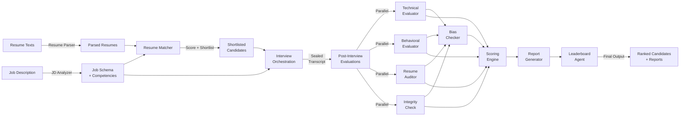

# OpenHire: Multi-Agent Hiring Evaluation System

An explainable, multi-agent AI system for automated candidate evaluation and screening. Uses specialized agents to analyze job requirements, parse resumes, conduct interviews, evaluate candidates across multiple dimensions, and produce transparent hiring recommendations with full evidence trails.

This is the Multi-Agent System role's implementation. See [roles/multi-agent.md](roles/multi-agent.md) for how this fits into the team's staged roadmap — this implementation covers the full Stage 3 agent split (orchestrator, technical/behavioral evaluators, integrity, bias checker, scoring, report generation, leaderboard) built ahead of schedule as a working foundation to grow into.

## 🎯 Problem Statement

Traditional recruitment processes are slow, inconsistent, and subject to human bias. OpenHire automates the screening and evaluation stages using a transparent, auditable multi-agent system that:

- **Extracts job requirements** automatically from job descriptions
- **Scores resume-job fit** with quantified matching
- **Conducts structured interviews** with adaptive questions
- **Evaluates multiple dimensions**: technical skills, behavioral fit, resume claim verification, integrity checks, and bias auditing
- **Provides explainable recommendations** with evidence trails for every decision
- **Produces ranked candidate leaderboards** with flagged items requiring human review

## 🏗️ Architecture

### System Overview



### Agent Responsibilities

| Agent | Input | Output | Purpose |
|-------|-------|--------|---------|
| **JD Analyzer** | Raw job description text | `JobDescription` with extracted competencies, skills, requirements | Parse job description into structured format with skill requirements and competency weights |
| **Resume Parser** | Raw resume text | `ParsedResume` with education, experience, skills | Normalize resume data into structured schema |
| **Resume Matcher** | Job description + Resume | `MatchingScore` with skill gaps and match % | Evaluate resume-job fit and shortlist candidates |
| **Interviewer** | Job description + Resume | List of `InterviewQuestion` objects | Generate adaptive, structured interview questions |
| **Technical Evaluator** | Job description + Resume + Transcript | `TechnicalEvaluation` with competency scores | Evaluate technical skills and depth against job requirements |
| **Behavioral Evaluator** | Job description + Resume + Transcript | `BehavioralEvaluation` with soft skill scores | Assess communication, problem-solving, teamwork, adaptability |
| **Resume Auditor** | Resume + Transcript | List of `ClaimVerification` results | Verify resume claims against interview discussion |
| **Integrity Agent** | Resume + Transcript | `IntegrityEvaluation` with flags | Detect inconsistencies and discrepancies between resume and interview |
| **Bias Checker** | All evaluations + Transcript | `BiasAudit` with flags and severity | Audit evaluation text for demographic/appearance/personality bias |
| **Scoring Agent** | All component evaluations + Job weights | `CandidateScores` (technical, behavioral, job_fit, final) | Synthesize component scores into final weighted score |
| **Report Generator** | All evaluations + Scores | `CandidateReport` comprehensive | Generate detailed evaluation report with recommendations |
| **Leaderboard Agent** | List of candidate reports | `CandidateLeaderboard` ranked | Rank candidates and highlight those requiring human review |

## 🔑 Key Features

### 1. Evidence-Based Evaluation
Every score has supporting evidence from the interview transcript or resume:
- Quote-level traceability with timestamps
- Sources clearly marked (transcript Q/A #, resume section)
- Explanation of relevance to competency assessment

### 2. Sealed Interview Transcripts
Once interview ends, transcript is immutable:
- Prevents evidence fabrication post-interview
- Ensures audit trail integrity
- Supports compliance requirements

### 3. Explainable AI
- No black-box scoring; every decision justified
- Visual breakdown of score components
- Recommendations include rationale
- Bias audit flags enable transparency

### 4. Parallelized Evaluation
Post-interview evaluations run concurrently:
- Technical, Behavioral, Resume Audit, Integrity checks execute in parallel
- Reduces total evaluation time
- Bias checker runs after parallel evaluations complete
- Scoring synthesizes all results

### 5. Provider Abstraction
Swap LLM, embedding, or vector store implementations:
- Local testing with mock providers (no API keys)
- Production deployments with OpenAI, Azure, or self-hosted
- Change providers via environment variables at runtime

Every `LLMProvider` implements two methods:
```
LLMProvider
├── generate(prompt) -> str                          # free-text completion
└── generate_structured(prompt, schema) -> dict       # schema-conformant JSON
```
Agents that need structured data (JD analysis, technical/behavioral
evaluation, resume audit, integrity/bias checks, interview question
generation) call `generate_structured()` with a JSON Schema derived directly
from a Pydantic model in `schemas/llm_outputs.py`
(`SomeModel.model_json_schema()`), then validate the response against that
same model (`SomeModel.model_validate(result)`) before converting it into the
agent's real output schema. Agents never hand-write JSON Schemas or call
`json.loads()`/catch `JSONDecodeError` themselves - that's the provider's
job. `BaseAgent.call_llm_structured(..., validate=SomeModel.model_validate)`
wires validation into the same bounded retry/timeout budget as provider
failures (see `agents/base.py`), so a malformed or schema-invalid response is
retried a bounded number of times and then fails explicitly - it is never
silently replaced with fabricated data.

- **Mock mode** (`LLM_PROVIDER=mock`, the default) requires no API key -
  `MockLLMProvider` returns deterministic, schema-valid responses for every
  known agent prompt, so the full pipeline and test suite run offline.
- **Real providers** (e.g. `LLM_PROVIDER=openai`) require credentials
  (`OPENAI_API_KEY`) and fail clearly - never silently falling back to mock -
  if they can't produce a valid response.
- Agents are provider-agnostic: they only ever call `generate()` /
  `generate_structured()` on `self.llm_provider` - never anything
  OpenAI/Claude/Gemini-specific. All vendor-specific logic (auth, request
  shape, transient-vs-permanent error classification) lives in
  `providers/llm/*.py`.

### 6. Comprehensive Auditing
- Audit log for every agent with duration and status
- Pipeline run tracking with error capture
- Compliance-ready execution traces

## 📊 Data Schemas

### Core Data Structures

**JobDescription** - Structured job posting
```python
{
  "job_id": "job_001",
  "title": "Senior Python Developer",
  "description": "...",
  "experience_years": 5,
  "required_skills": ["Python", "async"],
  "preferred_skills": ["Kubernetes"],
  "competencies": [
    {"name": "Python", "weight": 0.30},
    {"name": "System Design", "weight": 0.25},
    ...  # weights sum to 1.0
  ]
}
```

**ParsedResume** - Normalized candidate resume
```python
{
  "candidate_id": "cand_001",
  "candidate_name": "Alice",
  "email": "alice@example.com",
  "work_experience": [...],
  "education": [...],
  "skills": ["Python", "Kubernetes", ...],
  "total_experience_years": 6
}
```

**InterviewTranscript** - Sealed Q&A transcript
```python
{
  "interview_id": "int_001",
  "candidate_id": "cand_001",
  "exchanges": [
    {
      "question": {"question_id": "q1", "text": "..."},
      "answer": {"answer_text": "...", "timestamp": "2024-01-15T10:30:00Z"}
    },
    ...
  ]
}
```

**TechnicalEvaluation** - Technical skills assessment
```python
{
  "competency_scores": [
    {
      "competency_name": "Python",
      "score": 8.5,
      "evidence": [
        {
          "source_type": "transcript",
          "text": "I built async services using FastAPI...",
          "timestamp": "2024-01-15T10:30:30Z"
        }
      ]
    },
    ...
  ],
  "technical_score": 8.2,
  "strengths": ["Strong async patterns", "..."],
  "weaknesses": ["Limited GraphQL experience"]
}
```

**CandidateScores** - Final scores
```python
{
  "technical_score": 8.2,      # 0-10
  "behavioral_score": 7.8,     # 0-10
  "job_fit_score": 8.5,        # 0-10
  "weighted_final_score": 8.2  # 0-10 (weighted by job competencies)
}
```

**CandidateReport** - Comprehensive evaluation
```python
{
  "candidate_name": "Alice",
  "scores": {...},
  "technical_summary": "...",
  "behavioral_summary": "...",
  "recommendation": "strong_candidate",  # or "candidate", "human_review", "insufficient"
  "strengths": ["...", "..."],
  "weaknesses": ["...", "..."],
  "integrity_flags": [...],
  "bias_flags": [...],
  "requires_human_review": false
}
```

**CandidateLeaderboard** - Ranked candidates
```python
{
  "entries": [
    {
      "rank": 1,
      "candidate_name": "Alice",
      "weighted_score": 8.2,
      "recommendation": "strong_candidate",
      "requires_human_review": false
    },
    {
      "rank": 2,
      "candidate_name": "Bob",
      "weighted_score": 7.1,
      "recommendation": "candidate",
      "has_integrity_issues": true  # Flag for human review
    },
    ...
  ],
  "strong_candidates": 1,
  "candidates": 1,
  "requires_review": 1
}
```

## 🚀 Quick Start

These files live at the repository root (`agents/`, `schemas/`, `providers/`, `orchestration/`, `prompts/`, `config/`, `utils/`, `tests/`, `data/`, `main.py`).

### Installation

```bash
# From the repo root
python -m venv venv
source venv/bin/activate  # On Windows: venv\Scripts\activate

# Install dependencies
pip install -r requirements.txt

# Copy configuration
cp .env.example .env
```

### Running in Mock Mode (No API Keys Required)

```bash
# By default, LLM_PROVIDER=mock (deterministic, local-only)
python main.py
```

Output:
```
================================================================================
OpenHire Hiring Evaluation Pipeline - Demo Run
================================================================================

📋 Loading sample data...
🔨 Building schema objects...
✓ Job: Senior Python Backend Developer
✓ Candidates: 3
✓ Interview exchanges: 8

🔄 Initializing pipeline...
📊 Loading orchestration graph...

🚀 Starting pipeline execution...

Step 1: Analyzing job description...
Step 2: Parsing candidate resumes...
Step 3: Matching resumes to requirements...
...
Step 9: Creating leaderboard...

✅ Pipeline execution simulated
💾 Saving outputs...
✓ State saved to: output/run_abc123_state.json
✓ Job description saved to: output/sample_job_job_001.json
✓ Resume saved to: output/sample_resume_cand_001.json
...
```

### Running with OpenAI (Production Mode)

```bash
# Configure .env
export OPENAI_API_KEY=sk-...
export LLM_PROVIDER=openai
export EMBEDDING_PROVIDER=openai

# Run pipeline
python main.py
```

The OpenAI provider is structurally implemented but has not yet been live-tested against the real API — mock mode is the verified path.

## 📖 Pipeline Flow

### Phase 1: Pre-Interview
1. **Analyze Job Description**
   - Extract skills, requirements, competencies from job text
   - Normalize competency weights (must sum to 1.0)

2. **Parse Resumes**
   - Convert raw resume text to structured format
   - Extract work experience, education, skills

3. **Match Resumes**
   - Score resume-job fit using weighted matching (50% required, 20% preferred, 30% experience)
   - Generate shortlist (score ≥0.6 AND ≤2 missing required skills)

### Phase 2: Interview
4. **Generate Questions**
   - Create adaptive questions based on job rubric and resume
   - Questions target all competencies in job description

5. **Conduct Interview**
   - Collect Q&A pairs with timestamps
   - Seal transcript when complete (immutable)

### Phase 3: Post-Interview (Parallel)
6. **Parallel Evaluations** (run concurrently)
   - **Technical Eval**: Score competencies against job rubric; extract evidence from transcript
   - **Behavioral Eval**: Assess soft skills (communication, teamwork, problem-solving)
   - **Resume Audit**: Verify resume claims against interview discussion
   - **Integrity Check**: Flag inconsistencies between resume and interview

7. **Bias Check**
   - Audit all evaluation text for demographic/appearance/personality bias
   - Flag severity: low/medium/high

### Phase 4: Synthesis & Reporting
8. **Score**
   - Synthesize component scores using job competency weights
   - Calculate final 0-10 score

9. **Generate Report**
   - Create comprehensive evaluation with all sections
   - Determine recommendation based on score, integrity, bias flags

10. **Leaderboard**
    - Rank candidates by final score
    - Highlight those requiring human review

## 🎓 Understanding Recommendations

- **strong_candidate** (score ≥8.5): Ready to move forward; minimal flags
- **candidate** (score 7.0-8.4): Viable; proceed with caution
- **human_review** (5.5-6.9 or flag issues): Requires human recruiter review
- **insufficient_evidence** (<5.5): Does not meet minimum bar

## 🧠 Explainability & Transparency

### Evidence Trail Example

**Question**: "Describe your async Python experience"

**Candidate Answer**: *"I've been using asyncio for 3 years. In my current role, I redesigned our order processing service using FastAPI..."*

**Technical Evaluator Evidence**:
```
Competency: Async Programming
Score: 9.0
Evidence:
  - Source: Interview Q#2, timestamp 2024-01-15T10:30:30Z
  - Quote: "I've been using asyncio for 3 years..."
  - Relevance: Directly demonstrates depth of async experience
  - Explanation: Candidate shows 3+ years of hands-on asyncio experience
```

### Integrity Flag Example

**Resume Claim**: "Led architecture redesign achieving 10x throughput"

**Interview Discussion**: "We made incremental improvements to performance by optimizing queries"

**Integrity Evaluator Flag**:
```
Type: Claim Discrepancy
Severity: Medium
Evidence: Resume claims major architectural redesign and 10x gain; interview discusses gradual optimization
Status: Requires Human Review
```

### Bias Audit Example

**Flagged Text**: "She has great communication skills and attention to detail"

**Bias Check Finding**:
```
Flag Type: Gender-Coded Language
Severity: Low
Description: "She/attention to detail" uses gendered pronouns with task stereotyping
Confidence: 0.72
Recommendation: Replace with neutral language; rephrase evaluation
```

## 🔒 Security & Compliance

- **Immutable Transcripts**: Interview transcripts sealed immediately after interview; cannot be modified
- **Audit Logging**: Every agent logs execution (start/end time, duration, status, errors)
- **Evidence Traceability**: All scores link back to specific transcript quotes with timestamps
- **No Demographic Bias**: Bias checker audits evaluation text for appearance/personality/demographic assumptions
- **GDPR-Ready**: Outputs support right-to-be-forgotten (candidate_id can be purged from runs)

## 🛠️ Configuration

Environment variables (copy `.env.example` to `.env`):

```bash
# LLM Provider
LLM_PROVIDER=mock           # "mock" or "openai"
OPENAI_API_KEY=sk-...       # Only if using OpenAI
OPENAI_MODEL=gpt-4-turbo    # Default model

# Embeddings
EMBEDDING_PROVIDER=local    # "local" or "openai"
EMBEDDING_MODEL=all-MiniLM-L6-v2

# Vector Store
VECTOR_STORE_TYPE=mock      # "mock" or "faiss"

# Logging
DEBUG=false
LOG_LEVEL=INFO
LOG_FILE=logs/openhire.log

# Output
OUTPUT_DIR=output
```

## 🧪 Testing

```bash
# Run all tests
pytest

# Run specific test module
pytest tests/test_jd_agent.py -v

# Run with coverage
pytest --cov=agents --cov=schemas tests/

# Run integration tests
pytest tests/test_pipeline.py -v
```

37 tests currently pass covering schemas, individual agents, and full pipeline integration (mock provider, async parallel evaluation).

## 📁 Project Structure

```
config/
├── settings.py           # Configuration and environment setup
schemas/
├── __init__.py
├── job.py                # JobDescription, Competency
├── resume.py             # ParsedResume, WorkExperience, Education
├── interview.py          # InterviewTranscript, InterviewQuestion, InterviewAnswer
├── evaluation.py         # TechnicalEvaluation, BehavioralEvaluation, etc.
├── scoring.py            # CandidateScores, CandidateReport, CandidateLeaderboard
└── audit.py              # AuditLog, PipelineRun
providers/
├── __init__.py
├── llm/                  # LLMProvider (base + MockLLMProvider + OpenAIProvider)
├── embeddings/           # EmbeddingProvider (base + LocalEmbeddingProvider)
├── vector_store/         # VectorStore (base + FAISSVectorStore, MockVectorStore)
└── audio/                # AudioProcessor (base + MockAudioProcessor)
utils/
├── __init__.py
├── evidence.py           # create_evidence(), create_transcript_evidence()
├── validation.py         # validate_weights(), validate_score(), etc.
└── logging.py            # setup_logging(), get_logger()
prompts/
├── jd_analyzer.md        # Job description analysis prompt
├── resume_matcher.md     # Resume matching prompt
├── interviewer.md        # Interview question generation
├── technical_evaluator.md
├── behavioral_evaluator.md
├── resume_auditor.md
├── integrity.md
├── bias_checker.md
├── scoring.md
└── report_generator.md
agents/
├── __init__.py           # Exports all agents
├── base.py                # BaseAgent with audit logging
├── jd_analyzer/
├── resume_parser/
├── resume_matcher/
├── interviewer/
├── technical_evaluator/
├── behavioral_evaluator/
├── resume_auditor/
├── integrity/
├── bias_checker/
├── scoring/
├── report_generator/
├── leaderboard/
└── orchestrator/
orchestration/
├── __init__.py
└── graph.py               # LangGraph workflow definition
data/
├── __init__.py             # load_job_description(), load_resume(), etc.
├── sample_job.json
├── sample_resume_1.json
├── sample_resume_2.json
├── sample_resume_3.json
└── sample_transcript.json
tests/
├── conftest.py             # Pytest fixtures
├── test_schemas.py
├── test_jd_agent.py
├── test_resume_parser.py
├── test_agents.py
├── test_utilities.py
└── test_pipeline.py
main.py                     # Entry point script
requirements.txt            # Dependencies
.env.example                # Configuration template
```

## 🔄 Extending the System

### Adding a New Evaluation Dimension

1. **Create Schema** in `schemas/evaluation.py`:
```python
class NewEvaluationDimension(BaseModel):
    score: float = Field(..., ge=0, le=10)
    flags: List[Flag] = []
    explanation: str
```

2. **Create Agent** in `agents/new_evaluator/agent.py` - define the LLM's
   expected output shape as a Pydantic model in `schemas/llm_outputs.py`
   (e.g. `NewEvaluationResult`), narrower than the full downstream schema,
   then call `generate_structured()` with `validate=` so the response is
   parsed and validated in one step:
```python
class NewEvaluatorAgent(BaseAgent):
    async def execute(self, interview_transcript: InterviewTranscript, **kwargs) -> Dict:
        prompt = self.load_prompt("new_evaluator.md")
        result: NewEvaluationResult = await self.call_llm_structured(
            prompt,
            schema=NewEvaluationResult.model_json_schema(),
            validate=NewEvaluationResult.model_validate,
        )
        evaluation_obj = NewEvaluationDimension(score=result.score, ...)
        return {"new_evaluation": evaluation_obj}
```

3. **Add Prompt** in `prompts/new_evaluator.md`

4. **Integrate into Graph** in `orchestration/graph.py`:
```python
# Add node to StateGraph
graph.add_node("new_eval", node_run_new_evaluation)
# Add edge from parallel evaluations to new eval
graph.add_edge("parallel_evaluations", "new_eval")
# Update next edge to bias_check
graph.add_edge("new_eval", "bias_check")
```

### Adding a New LLM Provider

1. **Implement Provider** in `providers/llm/`:
```python
class CustomLLMProvider(LLMProvider):
    async def generate(self, prompt: str) -> str:
        # Your implementation
        pass

    async def generate_structured(self, prompt: str, schema: dict) -> dict:
        # Your implementation - schema is a JSON Schema dict (usually
        # SomeModel.model_json_schema() from schemas/llm_outputs.py).
        # Raise LLMTransientError for retryable failures (malformed/empty
        # response, rate limits, timeouts) and LLMPermanentError for
        # non-retryable ones (bad credentials, invalid request) - see
        # providers/llm/openai.py for a worked example.
        pass
```

2. **Update Factory** in `providers/llm/__init__.py`:
```python
def get_llm_provider() -> LLMProvider:
    if provider_type == "custom":
        return CustomLLMProvider()
    # ... other providers
```

3. **Set Environment Variable**:
```bash
LLM_PROVIDER=custom
```

## 📈 Performance Considerations

| Component | Typical Time | Notes |
|-----------|--------------|-------|
| JD Analysis | 5-10 sec | LLM parsing + schema creation |
| Resume Parsing (per candidate) | 2-5 sec | LLM-based + fallback regex |
| Resume Matching (per candidate) | <1 sec | Vector similarity search |
| Interview Q-Gen (per candidate) | 3-8 sec | LLM-based question generation |
| Technical Eval (per candidate) | 5-15 sec | Competency scoring + evidence extraction |
| Behavioral Eval (per candidate) | 3-10 sec | Soft skill assessment |
| Resume Audit (per candidate) | 4-10 sec | Claim verification |
| Integrity Check (per candidate) | 3-8 sec | Inconsistency detection |
| Bias Audit (per candidate) | 2-5 sec | Text analysis for bias |
| Scoring | 1-2 sec | Numerical computation |
| Report Generation | 2-4 sec | Aggregation + formatting |
| Leaderboard | <1 sec | Ranking |
| **Total (3 candidates)** | **2-3 min** | With parallel post-interview evals |

Post-interview evaluations run in parallel, reducing elapsed time significantly.

## ⚠️ Limitations & Future Work

### Current Limitations
- Mock LLM provider returns deterministic responses; real models required for production
- OpenAI provider is structurally implemented but not yet live-tested
- No multi-language support yet
- Interview simulation is text-based (no video/audio analysis)
- Bias detection focuses on text patterns, not demographic data (intentional)
- No user authentication or role-based access control

### Planned Enhancements
- [ ] Real-time interview transcription (speech-to-text)
- [ ] Video interview analysis (facial expressions, engagement)
- [ ] Multi-language support
- [ ] Interactive feedback loop for evaluators
- [ ] A/B testing framework for prompt optimization
- [ ] Integrated recruiter dashboard
- [ ] API endpoints for REST/GraphQL access
- [ ] WebSocket support for real-time evaluation updates
- [ ] Federated learning for cross-org bias reduction
- [ ] Explainability dashboard with interactive evidence exploration

---

Originally developed as a standalone project, migrated into the team repository on the `feature/parag-agents` branch.
